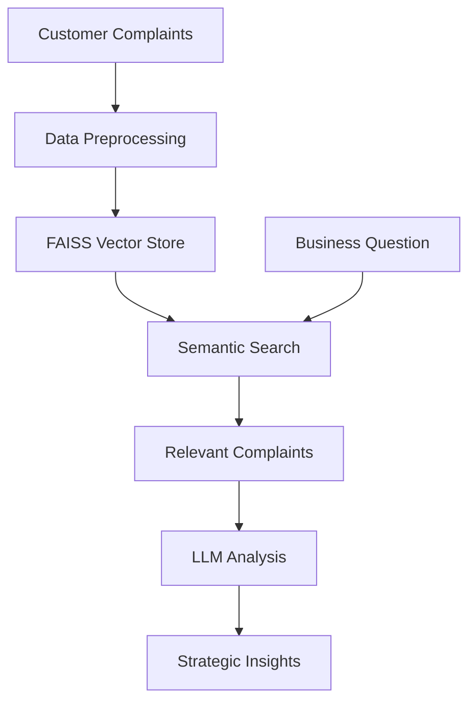

# 🤖 CrediTrust Financial - Complaint Intelligence AI

> Transforming customer complaints into strategic business insights across East Africa

[](https://streamlit.io/)
[](https://python.org/)
[](https://faiss.ai/)
[](https://huggingface.co/)

## 🌟 Overview

CrediTrust Financial is a fast-growing digital finance company serving **500,000+ customers** across **Kenya, Uganda, Tanzania, and Rwanda**. This AI-powered complaint intelligence system transforms unstructured customer feedback into actionable business insights, enabling product teams to quickly identify issues, track trends, and make data-driven decisions.

**Key Products Analyzed:**
- 💳 Credit Cards
- 🏦 Personal Loans  
- 📱 BNPL (Buy Now, Pay Later)
- 💰 Savings Accounts
- 🔄 Money Transfers

## 🚀 Features

### 🔍 Intelligent Complaint Analysis
- **Natural Language Querying**: Ask business questions in plain English
- **Semantic Search**: Find relevant complaints using AI embeddings
- **Multi-market Analysis**: Compare trends across East African countries
- **Product-specific Insights**: Drill down into specific financial products

### 📊 Business Intelligence
- **Executive Summaries**: AI-generated insights with quantitative analysis
- **Trend Identification**: Spot emerging issues before they escalate
- **Regional Comparisons**: Understand geographic variations in complaints
- **Actionable Recommendations**: Data-driven suggestions for improvement

### 🎯 Built for Product Teams
- **PM-Friendly Interface**: Designed for Asha (BNPL Product Manager) and team
- **Real-time Filtering**: Focus on specific products or markets
- **Example Questions**: One-click access to common business queries
- **Transparent Sources**: See exactly which complaints informed each analysis

## 🏗️ Architecture


## 🛠️ Technical Stack

| Component | Technology | Purpose |
|-----------|------------|---------|
| **Embeddings** | `sentence-transformers/all-MiniLM-L6-v2` | Convert text to numerical vectors for semantic search |
| **Vector Database** | FAISS (Facebook AI Similarity Search) | Efficient similarity search and retrieval |
| **LLM** | `google/flan-t5-base` | Answer generation and analysis |
| **Frontend** | Streamlit | Interactive web dashboard |
| **Text Processing** | LangChain | Text splitting and chunking |
| **Machine Learning** | PyTorch | Model inference and processing |
| **Data Processing** | pandas | Data manipulation and cleaning |
| **Numerical Computing** | NumPy | Mathematical operations |

## 📦 Installation

### Prerequisites

- **Python**: 3.8 or higher
- **Package Manager**: pip
- **Memory**: 4GB+ RAM recommended
- **Storage**: 2GB+ free disk space
- **Internet Connection**: For model downloads

### Step-by-Step Installation

#### 1. Clone the Repository
```bash
git clone https://github.com/credtrust/complaint-intelligence-ai.git
cd complaint-intelligence-ai
```
#### 1. Clone the Repository
```bash
# Linux/Mac
python -m venv venv
source venv/bin/activate

# Windows
python -m venv venv
venv\Scripts\
```
