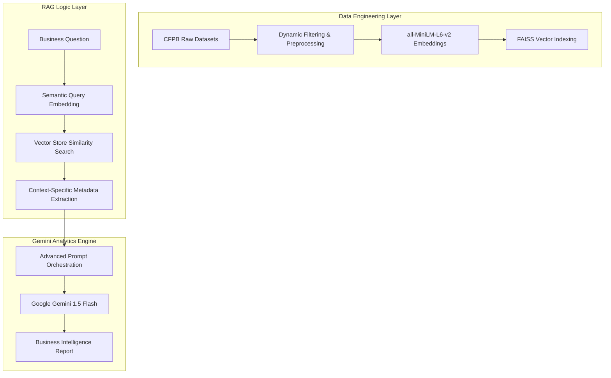

# CrediTrust Financial - Complaint Intelligence AI

**Transforming raw customer feedback into strategic business assets for East African FinTech.**

## Overview

CrediTrust Financial is a rapidly growing digital company serving **500,000+ customers** across **Kenya, Uganda, Tanzania, and Rwanda**. This AI-powered intelligence system leverages **Retrieval-Augmented Generation (RAG)** and **Google Gemini** to transform thousands of unstructured customer complaints into actionable, evidence-backed business insights for Product, Support, and Compliance teams.

## Key Performance Indicators (KPIs)

- **Rapid Trend Identification**: Reduce issue-to-insight time from days to minutes.
- **Democratized Analytics**: Empower non-technical stakeholders (PMs, Support) to query raw data using natural language.
- **Proactive Resolution**: Shift from reactive support to proactive product improvements based on real-time feedback.

---

## Core Products Analyzed

- **Credit Cards**
- **Personal Loans**
- **Buy Now, Pay Later (BNPL)**
- **Savings Accounts**
- **Money Transfers**

---

## System Architecture


```mermaid
graph TD
    subgraph "Data Engineering Layer"
        A[CFPB Raw Datasets] --> B[Dynamic Filtering & Preprocessing]
        B --> C[all-MiniLM-L6-v2 Embeddings]
        C --> D[FAISS Vector Indexing]
    end

    subgraph "RAG Logic Layer"
        E[Business Question] --> F[Semantic Query Embedding]
        F --> G[Vector Store Similarity Search]
        G --> H[Context-Specific Metadata Extraction]
    end

    subgraph "Gemini Analytics Engine"
        H --> I[Advanced Prompt Orchestration]
        I --> J[Google Gemini 1.5 Flash]
        J --> K[Business Intelligence Report]
    end
```

---

## Technical Stack

| Component | Technology | Purpose |
| :--- | :--- | :--- |
| **LLM Engine** | **Google Gemini 1.5 Flash** | Core reasoning, analysis, and synthesis. |
| **Vector Store** | **FAISS (Facebook AI Similarity Search)** | Ultra-fast similarity search of narrative embeddings. |
| **Embeddings** | **Sentence-Transformers (all-MiniLM-L6-v2)** | Transforming unstructured narratives into semantic vectors. |
| **Frontend** | **Streamlit** | Professional command center for business stakeholders. |
| **Orchestration** | **Python (LangChain, pandas)** | RAG pipeline management and data processing. |

---

## Implementation Features

### 1. Advanced Metadata Tracking
Every retrieved complaint excerpt includes original complaint IDs, product categories, and simulated geographic data (Kenya/Uganda/Tanzania/Rwanda) ensuring full auditability and regional context.

### 2. C-Suite Minimalist Interface
A zero-emoji, professional interface designed for enterprise environments, featuring response streaming and dark-themed minimalist styling.

### 3. Business Intelligence Prompts
Custom-engineered prompts that force the AI to act as a **Senior Financial Analyst**, focusing on quantitative insights, regional patterns, and actionable recommendations.

---

## Setup and Installation

### Prerequisites

- Python 3.9+
- Google Gemini API Key

### Step-by-Step

1. **Clone the Repository**
   ```bash
   git clone https://github.com/yourusername/creditrust-complaint-rag.git
   cd creditrust-complaint-rag
   ```

2. **Environment Configuration**
   Create a `.env` file or set the following variable:
   ```bash
   export GOOGLE_API_KEY="your_api_key_here"
   ```

3. **Install Dependencies**
   ```bash
   pip install -r requirements.txt
   ```

4. **Launch the Command Center**
   ```bash
   streamlit run app.py
   ```

---

## Business Impact Showcase

This tool was designed for stakeholders like **Asha, PM for BNPL**, who previously spent hours reading feedback to guess at emerging issues. Today, Asha can identify a breakdown in Kenyan payment processing in seconds, backed by direct customer narratives and regional trend analysis.

---

Built for **CrediTrust Financial** | AI-Powered Complaint Intelligence v2.0
